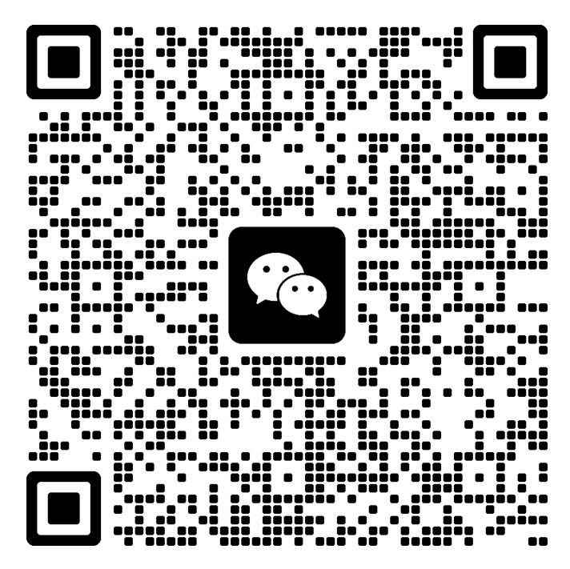

qdd

## 启动
1.拷贝 config.yaml.example 为 config.yaml
2.修改 config.yaml
  - 修改公众号配置
  - 修改 OpenAI 配置
  - 修改 UNSPLASH_KEY
3.安装依赖
在 Linux 或 MacOS 下：
```bash
python3 -m venv .venv
source .venv/bin/activate
pip install -r requirements.txt
```
在 Windows PowerShell 下：
```bash
python3 -m venv .venv
.\venv\Scripts\Activate.ps1
pip install -r requirements.txt
```

4.安装 playwright
```bash
playwright install
```
5.开始搞钱
```bash
python3 qdd.py
```
6.业务交流

